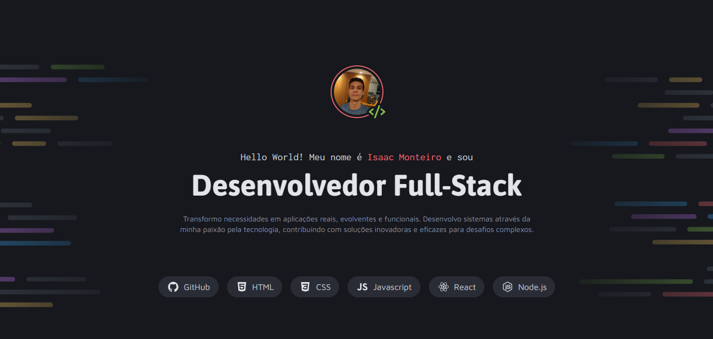

# 👨‍💻 Portfólio Pessoal | Isaac Monteiro

<div align="center">
  
</div>

<br>

<div align="center">

  [](https://github.com/is4ac-dev)
  [](https://www.linkedin.com/in/isaac-monteiro-0905863a0/)
  [](mailto:isaacmonteiro.fm@gmail.com)

</div>

<br>

## 🔖 Sobre

Este repositório contém o código-fonte do meu **Portfólio Pessoal**, desenvolvido para apresentar minha carreira como **Desenvolvedor Full-Stack**. O projeto funciona como um cartão de visitas digital, centralizando meus projetos, serviços oferecidos e canais de contato.

O foco do desenvolvimento foi criar uma interface limpa, responsiva e com uma arquitetura de código organizada e escalável, utilizando conceitos modernos de CSS semântico.

---

## 🚀 Tecnologias e Ferramentas

O projeto foi construído com as seguintes tecnologias:

### Core
- **HTML5 Semântico**: Estruturação acessível e organizada.
- **CSS3**: Estilização avançada com foco em modularidade.
- **JavaScript**: Interatividade e dinamismo.

### Estilização & Design System
- **CSS Variables (`:root`)**: Definição de tokens de design para cores e tipografia, facilitando a manutenção e temas.
- **CSS Modules**: Arquitetura de estilos separada por componentes (Intro, Projects, Services, Contact).
- **Flexbox & Grid Layout**: Para responsividade fluida.

### Fontes (Google Fonts)
- **Asap**: Títulos e destaques.
- **Inconsolata**: Elementos de código e subtítulos técnicos.
- **Maven Pro**: Texto corrido e parágrafos.

---

## 📂 Estrutura de Pastas

A organização do projeto segue uma estrutura lógica para facilitar a manutenção:

```bash
/
├── index.html          # Arquivo principal
├── assets/             # Imagens, ícones e recursos estáticos
│   ├── icons/          # Ícones SVG (Github, LinkedIn, Techs)
│   └── images/         # Thumbnails dos projetos e avatar
└── styles/             # Arquitetura CSS modular
    ├── global.css      # Reset CSS e configurações globais
    ├── style.css       # Design Tokens (Variáveis de cores e fontes)
    ├── index.css       # Hub de importação de estilos
    ├── intro.css       # Estilos da seção "Hero"
    ├── projects.css    # Estilos da grade de projetos
    ├── services.css    # Estilos da seção de serviços
    └── contact.css     # Estilos do rodapé e formulários
